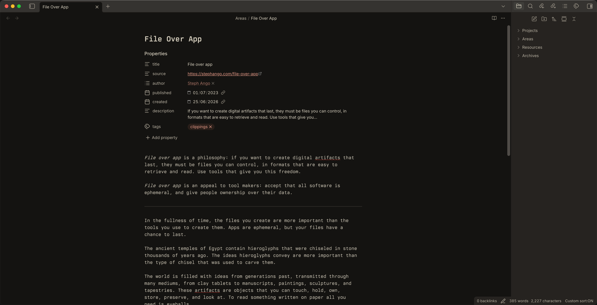
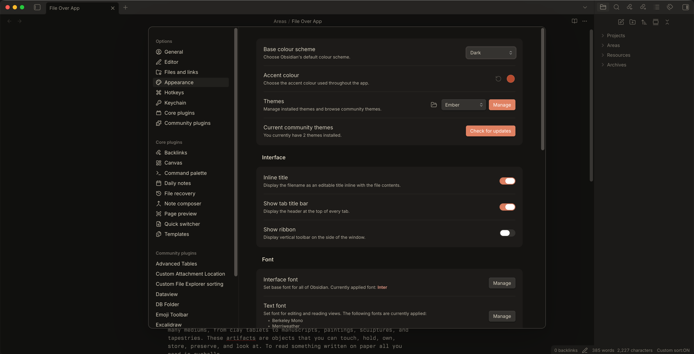
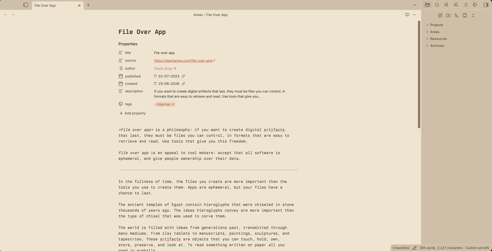
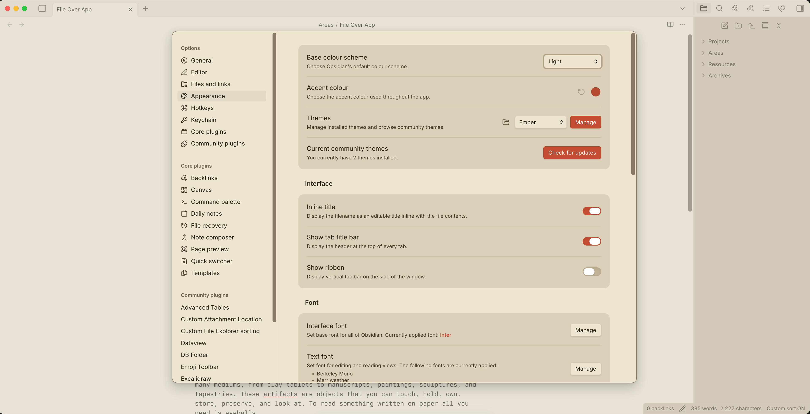

# Ember Theme

> This Obsidian theme is inspired by the Ember colorscheme. Ember's original palette and design credits belong to its creator(s).

Official website: https://embertheme.com/

Ember is a warm, high-readability Obsidian theme designed for focused writing, note-taking, and long reading sessions.

## Features

- Dark and Light variants
- Warm Ember-inspired color palette
- Comfortable typography for reading and writing
- Clean code block styling
- Consistent callout and markdown rendering
- Minimal visual distractions

## Dark Variant

## Light Variant

## Installation

1. Download or clone this repository.
2. Copy the theme folder into your Obsidian themes directory:
   - macOS: `~/Library/Application Support/obsidian/themes/`
   - Windows: `%APPDATA%\Obsidian\themes\`
   - Linux: `~/.config/obsidian/themes/`
3. Open **Settings → Appearance → Themes** in Obsidian.
4. Select **Ember** from the list.

## Attribution

This theme is inspired by the Ember colorscheme.

All credits for the original Ember palette and design belong to their respective creators.

## License

MIT
